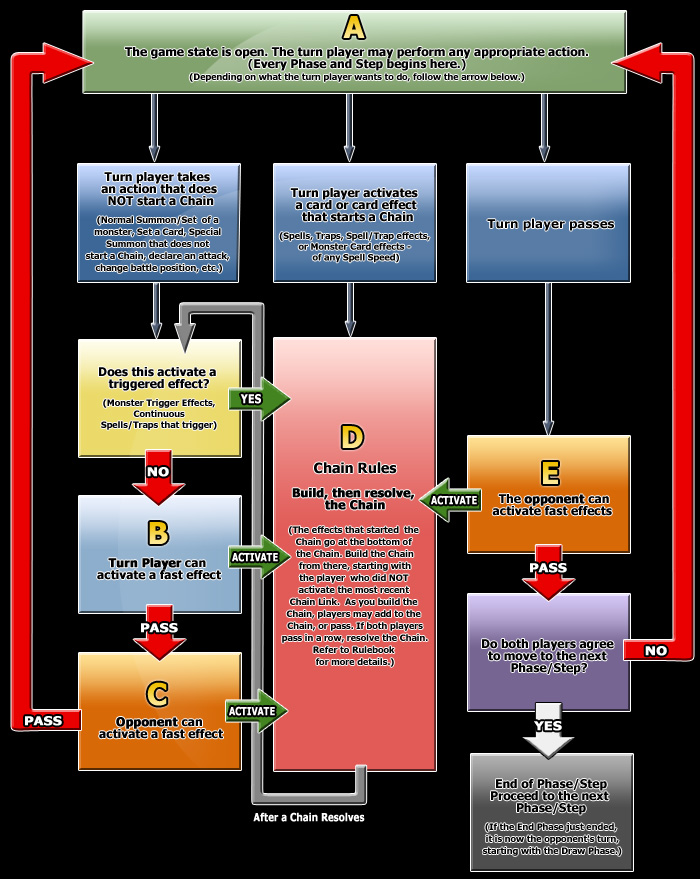

# Priority

* Players have priority, not cards
* The turn player **always** has priority to do the first action during each of their turn phases. This even includes the steps of the Battle Phase and _even_ the sub-steps of the Damage Step
* The turn player **passes priority** to the non-turn player **every time they decide to end their current turn phase**. This even includes the steps of the Battle Phase and _even_ the sub-steps of the Damage Step.

## Some things to keep in mind

* If the turn player passes priority because they wanted to end their current turn phase and the non-turn player activated an effect/card, after the chain resolves priority returns to the turn player and **the turn phase has not changed yet**. e.g. Turn player wants to end Main Phase 1 in order to proceed to Battle Phase. Non-turn player has set Scapegoat and Mirror Force. Upon turn player passing priority, the non-turn player activates and resolves Scapegoat. Priority returns to the turn player **and they are still in Main Phase 1**. Turn player then opts to completely skip the Battle Phase and proceed to End Phase instead.
* The turn player has priority to respond to the resolution of a Chain.

All in all, all you need to know is the following flow chart:

>[!IMPORTANT]
> In GOAT players can also activate [Ignition Effects](./Spell%20Speeds%20and%20Effect%20Types.md) while 
> the timing is in **Box B**. That's all. That's the only difference with Advanced Format.